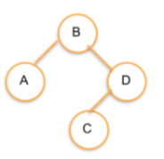

## Binary Node Add

## Challenge

Implement the add method for this `BinaryTreeNode` class:

```js
class BinaryTreeNode {
  constructor(value) {
    this.value = value;
    this.left = null;
    this.right = null;
  }

  add(node) {
    //we know B is the root of the tree so we need to filter either to the right or left based on value
    //where greater goes to the right and less goes to the left
    let currentNode = this;
    while (node) {
      if (node.value > currentNode.value) {
        if (currentNode.right === null) {
          //if there is no node to the right AND our currentNode is greater than root "B" we place current node to the right of root
          currentNode.right = node;
        }
        //if a node to the right does exist we need to recursively check until placement is correct
        currentNode = currentNode.right;
        //then we need to check factors for the left side
      } else {
        if (currentNode.left === null) {
          currentNode.left = node;
        }
        currentNode = currentNode.left;
      }
    }
  }
}
```

Keep in mind this is a recursive operation.

## Test Cases

```js
const B = new BinaryTreeNode('B');
const A = new BinaryTreeNode('A');
const C = new BinaryTreeNode('C');
const D = new BinaryTreeNode('D');

// B will be the root of the tree:
B.add(A);
B.add(D);
B.add(C);
```



## Note

FYI: the shape of a Binary Tree is dependant on order of construction.
